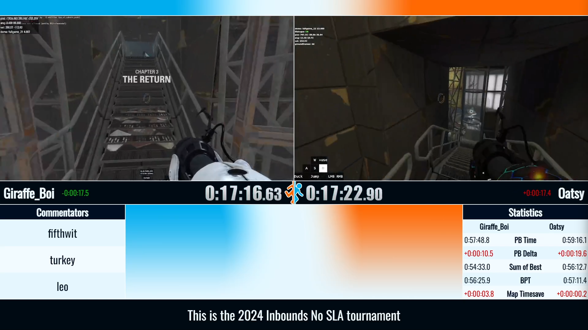

# P2SR Live Graphics

[NodeCG](http://nodecg.dev) package used for [Portal 2 Speedruns livestreams](https://www.twitch.tv/portal2speedruns). Feel free to use this repo as a learning tool, since its designed to be inherently simple.

This bundle depends on [nodecg-speedcontrol](https://github.com/speedcontrol/nodecg-speedcontrol) for runner data.

## [therun.gg](https://therun.gg/) Support

A key feature of the graphics is live data, taken from therun.gg, a live updating website designed for speedrun statistics. On some of the individual layouts, a statistics box is visible showing individual runner stats, as well as a comparison of runner deltas next to their names.

Currently the bundle only supports 1v1 races with two players, however if needed more comparisons can be added (primarily 1v1v1v1 for four players).